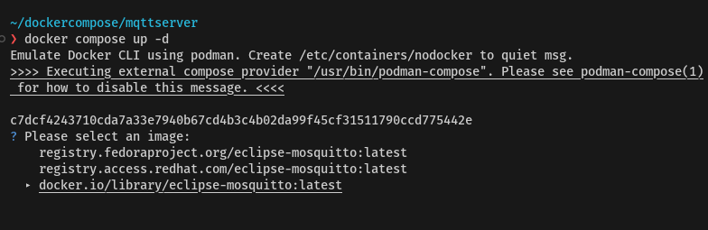

# mqtt server 

**Step 1 Create folder**
``` 
mkdir mqttserver
code docker-compose.yml
```

**Step 2 Create file docker-compose.yml**
```
services:
  mosquitto:
    user: "0:0"
    image: eclipse-mosquitto:2.0.19
    hostname: mosquitto
    container_name: mosquitto
    restart: unless-stopped
    ports:
      - "1883:1883"
      - "9001:9001"
    volumes:
      - ./config:/mosquitto/config:Z
      - ./data:/mosquitto/data:Z
      - ./log:/mosquitto/log:Z
```

**Create file /config/mosquitto.conf**
```
allow_anonymous false
listener 1883
listener 9001
protocol websockets
persistence true
password_file /mosquitto/config/passwd
persistence_file mosquitto.db
persistence_location /mosquitto/data/
log_dest file /mosquitto/log/mosquitto.log
log_dest stderr
```

**Create file /conf/passwd  keep username and password**
```
mqttadmin:1234P@ssword
```


[https://hub.docker.com/_/eclipse-mosquitto](https://hub.docker.com/_/eclipse-mosquitto)


**Directories**
Three directories have been created in the image to be used for configuration, persistent storage and logs.
```
/mosquitto/config
/mosquitto/data
/mosquitto/log
```

Click [Dockerfile](https://github.com/eclipse/mosquitto/blob/e96ddfc6e58f7087b9fa57a717d7f56d2c00f9fe/docker/2.0-openssl/Dockerfile)


- **CMD ["/usr/sbin/mosquitto", "-c", "/mosquitto/config/mosquitto.conf"]**


Run Docker compose up 
```
docker compose up -d
```


Select docker.io registroy then enter. docker compose will download image


Run Docker compose ps


**Step 3 Security Configuration**
- create username and password
Set the Mosquitto configuration file is ```/etc/mosquitto/mosquitto.conf```

- Create file ```/mosquitto/mosquitto.conf``` in project folder

```
code ./mosquitto/mosquitto.conf
```

paste this text to file content:
```
allow_anonymous false
password_file /etc/mosquitto/passwd
```

Explain:
- **allow_anonymous false**  Disables anonymous connections
- **password_file  /etc/mosquitto/passwd** location of password file

**Step 4 Edit the password file with this command:**
```
code ./mosquitto/passwd
```

Enter username/password in format:
```
username:password
```
Example:
```
mqttuser:P@ssw0rd
```

**Step 5 Mosquitto User: Encript the password** 


```
docker  compose exec mosquitto sh
```

Run command mosquitto_passwd in container
```
docker compose exec mosquitto mosquitto_passwd -U /mosquitto/config/passwd
```

```
docker  compose exec mosquitto sh
/# cat /mosquitto/config/passwd

/# exit
```
Example:
```
mqttuser:$7$101$n9DHRNjU7WBkloMP$t9w87LhuY5PAkIiWpq8jrT7oDW/ALECt+4ICzRjn/G9TAaFqeBt2f2WDC8HGJCgOQ1zEBK/ERxjWWRElnp9Dlw==
```
You will see the password encrypted.
**Step6 Restart Mosquitto**
```
docker compose restart
```

**Step7 Add user**
Add other use
```
docker exec mosquitto mosquitto_passwd -b /etc/mosquitto/passwd user password
```

https://stackoverflow.com/questions/78590294/how-to-fix-user-creation-issue-in-eclipse-mosquitto-docker-deployment-without-re

https://medium.com/@tomer.klein/docker-compose-and-mosquitto-mqtt-simplifying-broker-deployment-7aaf469c07ee